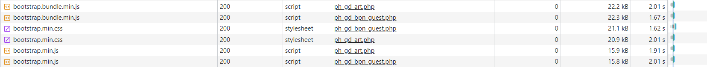
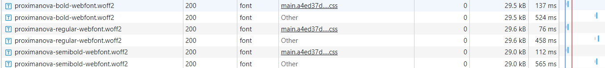
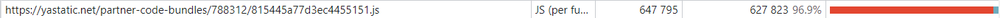

# Network

## Профиль загрузки ресурсов

Можно найти [здесь](https://disk.yandex.ru/d/Ns1thwluGP3jnw)

## Неоптимальные места

### Дублирование ресурсов

- bootstrap.bundle.min.js, bootstrap.min.css, bootstrap.min.js
  

- code.js
  

- data:image/png;base...
  

- fontawesome-webfont.woff2?v=4.7.0
  

- jquery-3.5.1.js
  

- openapi.js
  

- ph_gd...php
  

- photoFileName (хотя другие кэшированы)
  

- popper.min.js
  

- proximanova-bold-webfont, proximanova-regular-webfont.woff2, proximanova-semibold-webfont
  

- system_gd-logo
  

### Лишний размер ресурса

- 9039-finansovyy-kontrol. Используется лишь на 50% судя по Coverage. Много закомментированного кода, ненужного форматирования (доп байты). Можно вынести неиспользуемый код в отдельные js/css файлы и загружать по необходимости.
  
  

- context.js. Используется лишь 54% из 316 kB (91 kB gzip), что достаточно большой размер.
  

- partner core bundles. Сторонний код, используется ли 3% из 647 kB. Предполагая, что стоит отказаться от данного ресурса из за крайне маленькой эффективности.
  .

- common_frontend.css. 86% не используется при большом размере, нужно вынести первично неиспользуемые стили в отдельные файлы.
  

- Аналогично вышеописанному для ресурсов ниже.
  

- Шрифт FontAwesome. Единственное место, где используется этот шрифт, представлено на скриншотах ниже. Сам шрифт весит 77 kB при загрузке. То есть бесполезная трата трафика.
  
  
  

- Шрифт ProximaNova. Используется в единственной кнопке регистрации/логина. Шрифт весит около 30 kB.
  
  
  

### Медленно загружающиеся ресурсы

Ресурсы загружающиеся дольше, чем сама страница (9039-finansovyy-kontrol), признаны медленными.

### Ресурсы, блокирующие загрузку

- Файлы стилей в header, загружающиеся через link.
  
  

- Скрипты, загружающиеся в header через тег script, имеют большой приоритет и мешают браузеру рендерить контент. Можно их перенести в конец body. Ниже представлены примеры скриптов и их обращения во внешние ресурсы.
  
  

- Виджеты от сторонних поставщиков, заставляющие пользователя ждать рендеринг
  

- Lighthouse не заподозрил никаких потенциальных ресурсов, мешающих рендерингу. Хотя можно было вынести view.js в конец body.
  
  

### Что-то ещё

- CORS Error
  

- Лениво загружать embed'ы
  

- Кэшировать сторонние ресурсы. Например, виджеты от вк.
  
  

- Кнопки как изображения вместо использования css.
  

- Огромные payload. Например для вк.
  

# Slow

## Профиль загрузки ресурсов

Можно найти [здесь](https://disk.yandex.ru/d/c1jSb9kzbnyz-A)

## Неоптимальные места

Показало те же результаты, что и при обычном тестировании. См. [выше](#неоптимальные-места)
