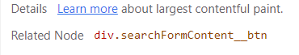
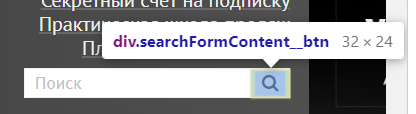
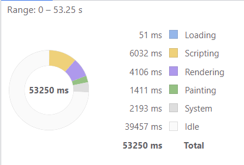
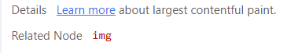
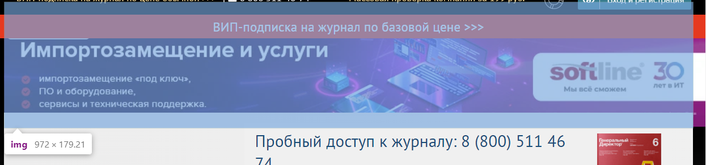
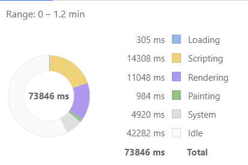

# Performance

## Профиль загрузки страницы

Профиль можно найти [здесь](https://disk.yandex.ru/d/Z899MmCqfxdl8Q)

## Время в миллисекундах от начала навигации до событий

- First Paint (FP) - 1218.9
- First Contentful Paint (FCP) - 1218.9
- Largest Contentful Paint (LCP) - 1260.6
- DOM Content Loaded (DCL) - 9002.7
- Load - 39383.6

## DOM-элемент на котором происходит LCP

```html
<div class="searchFormContent__btn"></div>
```

Первоначально рассчитывалось на finansovyy-kontrol.jpg, однако после двух перезагрузок и прокручиваний Perfomance указывает на иконку лупы.



## Время на этапы обработки документа

Total - время до полной загрузки страницы.

- Loading - 51 ms
- Scripting - 6032 ms
- Rendering - 4106 ms
- Painting - 1411 ms
  

# Slow

## Профиль загрузки страницы

Профиль можно найти [здесь](https://disk.yandex.ru/d/yQ0W5NTbUPP6gQ)

## Время в миллисекундах от начала навигации до событий

- First Paint (FP) - 9289.6
- First Contentful Paint (FCP) - 9289.6
- Largest Contentful Paint (LCP) - 42775.1
- DOM Content Loaded (DCL) - 38700.2
- Load - 72390.4

## DOM-элемент на котором происходит LCP

```html

```




## Время на этапы обработки документа

Total - время до полной загрузки страницы.

- Loading - 51 ms
- Scripting - 6032 ms
- Rendering - 4106 ms
- Painting - 1411 ms
  